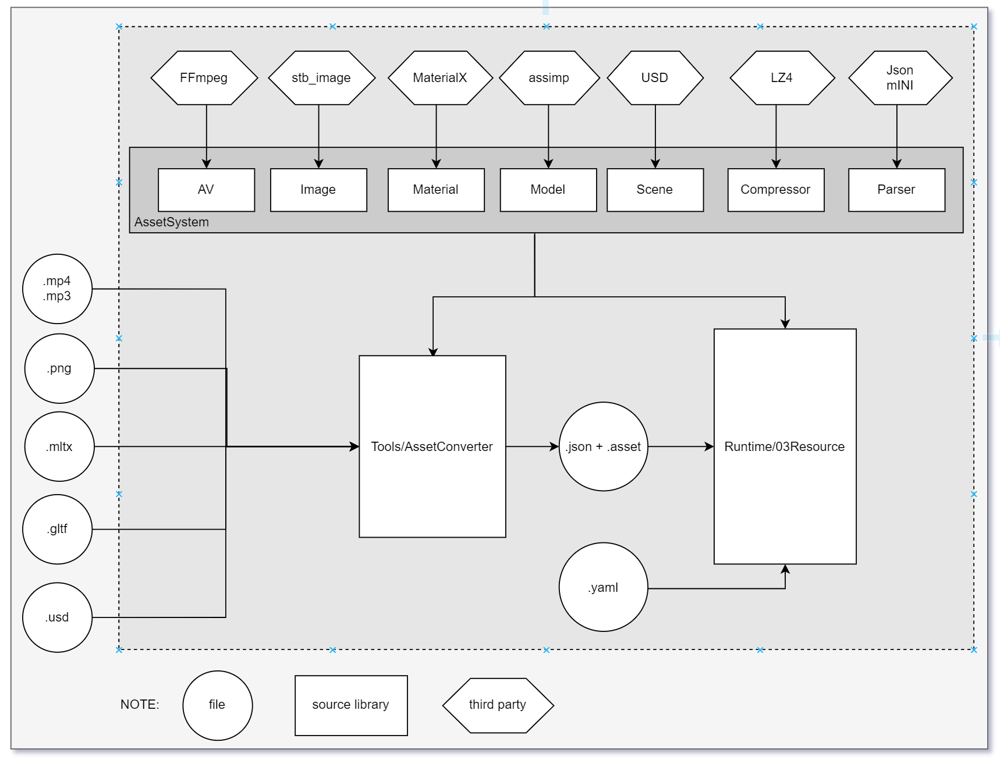

# Asset System

## Overview

We convert all assets into a engine-specific fast-loadable format off-line, and then load that at runtime. Why do this: 

pros:
- Orders of magnitude faster loading.
- Can customize the formats for what the engine needs.
- Formats can be stored in a platform specific way so that at runtime the bulk data can be copied directly into VRAM
- Only one format to deal with in the main runtime engine, convert every other format to that one.
- Heavy asset loading third party libraries like Assimp or FBX SDK are left outside of the main executable.
- Heavily simplified runtime logic for loading

cons:
- Need to develop and maintain the custom formats.
- Need to develop and maintain a converter that converts from classic formats into the custom one.
- Custom formats won’t be readable by any tool.

## Custom Asset Format
We are going to keep the file format very simple, while still being very fast to load.  
Similar to the glTF format, all assets will follow the format of **json metadata + compressed binary blob** (small size but high operating density data,  big size but operating fixed data).