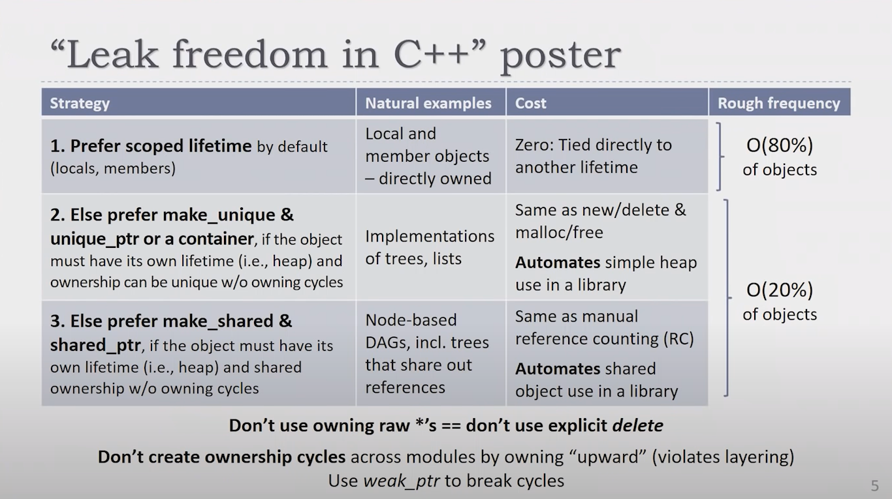

# Code Style

# Arch

## How to use pointer (screenshot from [Leak-Freedom in C++... By Default](https://www.youtube.com/watch?v=JfmTagWcqoE))


### Goal:

- No dangling/invalid deref(use after delete)
- No null ref
- No leaks(delete objects when no longer used, and delete only once)

### Strategy:



### Summary:

- owning + share between objects, use make_shared
- owning + not share, scoped, stack-like, use make_unique
- circular reference, use make_weak, (but this should be avoided when design)
- no ownership, use raw ptr

## Naming Convention

### File Extensions

The project uses the following file extensions:
- .cpp, c++ source file
- .hpp, c++ public header file
- .hxx, c++ private header file, only be include by the file in the same module or layer
- .inl, code snippet, only be included by some specified .cpp
  
NOTE:
- All other extensions(.h, .c, ...) come from third-party libraries,
- All included header from third-party libraries, will be surround by `<>`,
- All included header of the project, will be surround by `""`,

### CXX Code

```c++
#define AXE_TEST 1                     // MACRO, all upper-cases and with prefix AXE_
constexpr auto APP_NAME = "Hello";     // constant evaluated at compile-time, all upper-cases

class FruitVendor                      // Type, upper-case camel
{
private:
    int _mBestIndex;                   // `_` refers to private, `m` refers to member
    int _m_bestIndex                   // is also OK

    const int BEST_INDEX = 1;          // for constant, all upper-cases is enough

    static  int _s_currentIndex = 1;   // `s` refers to static
    static  int _sCurrentIndex = 1;    // is also OK
    static  int _msCurrentIndex = 1;   // is also OK

    int* _mpBestIndex;                 // `p` refers to pointer
    int* _mp_bestIndex;                // is also OK

public:
    int mIndex;
    int m_index;

private:
        int _getValue();               // (static) member function uses lower-case camel
        static int _getDate();
    public:
        int getValue();
        static int getDate();
private:

    char _mChar;
    char _m_char;

    struct Pair { int x, y; };
    Pair _mPair;
    Pair m_pair;

    Parent* _mpParent;                // raw pointer refer to a reference
    Parent* _mp_parent;               // is also OK

    
    std::unique_ptr<Image> _mpImage;  // resource handle(has ownership)
    std::unique_ptr<Image> _mp_image; // is also OK
    
    typedef Allocator_T* Allocator;
    Allocator _mpAllocatorHandle;     // raw pointer from external library
                                      // refer to resource handle(has ownership)
    Allocator _mp_allocatorHandle;    // is also OK

    std::vector<u32> _mIndices;       // resource will be release automatically
    std::vector<u32> _m_indices;      // is also OK
};

static int gs_count;        // `g` refer to global
static int gsCount;         // is also OK

const int MAX_NUM = 10;     // for constant, all upper-cases is enough

int gArray[MAX_NUM];        // `g` refer to global
int g_array[MAX_NUM];       // is also OK

void foo_func() {}          // common function uses lower-snake naming
static void foo_func() {}   // OK
static void _foo_func() {}  // OK

struct Apple {
    int vendorId;           // not mVendorId since struct just a aggregation of
                            // variables and no complex encapsulation or functionality
    const char* pName;
};

enum class FruitFlag {          // used for multi-element, maybe one or more flags
    APPLE  = 0,
    ORANGE = 1 << 0,
    PEAR   = 1 << 1,
    CHERRY = 1 << 2,
};
using FruitFlagOneBit = FruitFlag; // used for a specified element, must be one flag(namely, single bit)

FruitFlag fruits = FruitFlag::APPLE | FruitFlag::ORANGE;      // OK
FruitFlagOneBit fruit = FruitFlag::ORANGE                     // OK
FruitFlagOneBit fruit = FruitFlag::ORANGE | FruitFlag::CHERRY // not allowed

```

