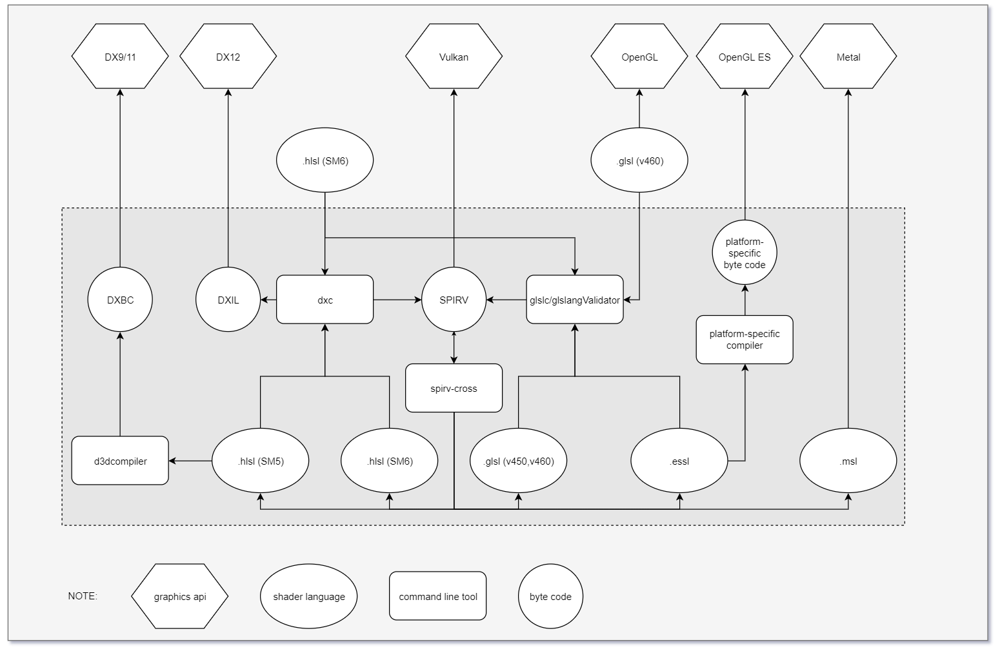

# Runtime

Runtime divides all modules into xx layers to represent dependencies between different modules. For each layer:
- is a module(e.g., 02Rhi), or a bundle of modules(e.g., 00Core, 08System)
- is compiled as a static library
- is not allowed to call functions from higher layers

---
## 00Core

List the features of all modules(alphabetically) in this layer:

### IO

### Log
a wrapper for spdlog.

### Config

Axe has lots of configurable options, which can be grouped into a few types:

| Type                 | Loading&Saving                                               | Example                        |
| -------------------- | ------------------------------------------------------------ | ------------------------------ |
| compile-time options | load from CMakeLists.txt and `Config.hpp` of each layer; No saving | build type is release or debug |
| per-engine(runtime)  | yaml files saved under engine source folders(`Configs/**/*.yaml `) |                                |
| per-game(runtime)    | yaml files saved under game project source folders           | player's maximum walk speed    |
| per-player (runtime) | yaml files saved under environment variable folders(e.g., `getenv("AppData")`) | quality of anti-aliasing       |

#### Loading/Saving Formats

- regular file formats
  - json(structured formats, has formal spec, easy to read, but not text-compact,  **not recommended since it is intend for data transport and no comments**)
  - xml(structured formats, has formal spec, **not recommended due to verbose**, not easy to read)
  - toml (open source spec, advance of ini, easy to learn, good for trivial file, but **not recommended  for complex configures** )
  - yaml, a superset of json, [an example of tomal vs yaml](https://gist.github.com/oconnor663/9aeb4ed56394cb013a20)
  - ini(widely used on Windows, compact text, **not recommended because no formal spec**, many INI dialects)
  - compressed-binary(useful on limited device, such as embedded system, **not recommended due to readability**)
- Windows registry(more dependence on OS, not recommended, see [Was The Windows Registry a Good Idea?](https://blog.codinghorror.com/was-the-windows-registry-a-good-idea/) below for its weakness )
- command line(usually for exposing a small subset of options)
- online user profiles
- your language (used for dynamic language that does not need to be compiled&linked. e.g., python)

#### `Config.hpp`

a header-only module that defines lots of useful macros. It is also all global macros of axe. That is to say: All global macros of axe are placed here. In other words, It is not allowed to define any global macros outside of the header.

### Math

a wrapper for glm

### Memory 

a wrapper for mimalloc.
- Overloaded operator `new` and `delete`
- Modified the default `std::pmr::memory_resource()`

### Thread

Concept:

- process: on a single computer, multiple processes can run, each process has its own memory space
- thread, within a process, multiple threads pre-emptively scheduled by OS kernel can run, all threads of a process share its memory space
- fiber, similar to a thread, within a single thread, multiple fibers scheduled by programer can run, has a lifespan independent of the code that launched it
- coroutine, more similar to a function, cooperative controlled by programer, has not concepts about "lifespan independent of its invoker", "blocking", "detaching", "scheduler"

[N4024: Distinguishing coroutines and fibers](http://www.open-std.org/jtc1/sc22/wg21/docs/papers/2014/n4024.pdf)

### Window
a wrapper for SDL_Window

---

## 01Resource

NOTE: "Resource" refers to all files except for source code; "Asset" and "Resource" have similar meanings, but "Asset" emphasizes more on art resources.

- Resource Manager (runtime)
  - [ ] Resource registry and GUIDs, which ensures that only one copy of each unique resource is loaded into memory at any given time
  - [ ] Resource lifetime, or management of  the *memory usage* 
  - [NEVER ADD] packaging, loading of *composite resources*,  and (de)compression of resources
  - [NEVER ADD]  Maintains *referential integrity* between files or within a file
  - [NEVER ADD] Permits *custom processing* to be performed on a resource before/after it has been loaded, on a per-resource-type basis
  - [ ] provides a single *unified interface* through which a wide variety of resource types can be managed.
  - [ ] handles *streaming* (i.e., asynchronous resource loading)

- ACP(Asset Conditioning Pipeline) (off-line)

  - [ ] asset compilers, or asset converter
  - [ ] asset linkers, or asset packager
  - [ ] resource dependencies and build/compile/convert rules
- [NEVER ADD] Resource Database, to upload/download/create/delete/inspect/move all types of resources, search/query resources in various way, maintain revision history

---

##### Shader Cross Compilation

Choose one of hlsl and glsl as handwritten, and then run it on all platforms.

## 02Rhi

Based on webGPU draft and open source framework The-Forge.

## 08System

## 12Gameplay

## 14App