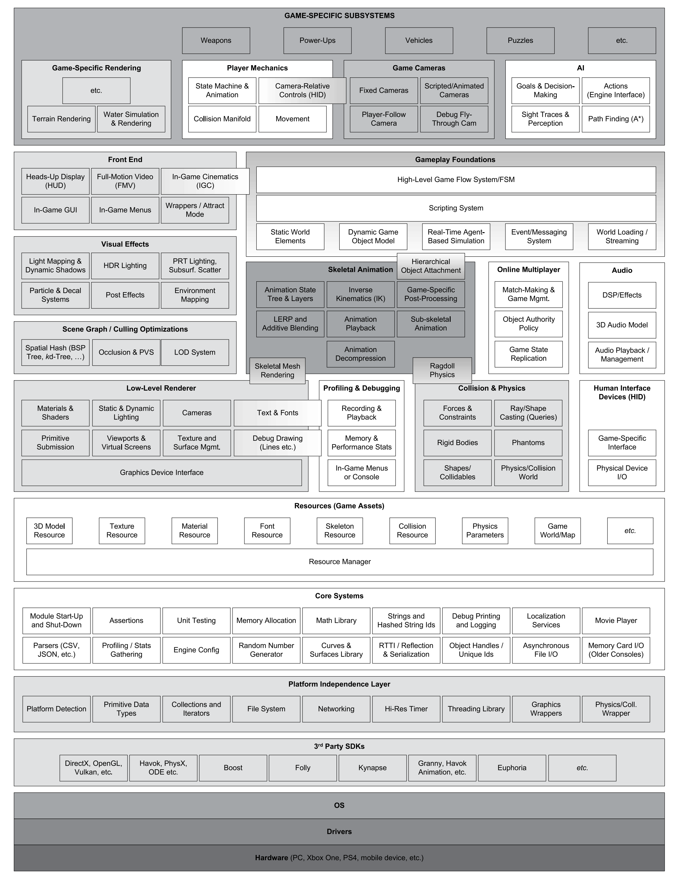

# Axe
Axe is a cross multi-platform toy game engine.

## Goal

- practice modern c++ programming skills (C++20, OOP, STL, template, multi-threading, reflection, etc)
- learn cross platform build and develop skills (Windows, Linux, MacOS)
- dive into more underlying details about modern graphics apis (Vulkan, D3D12, Metal)
- explore architecture of modern game engine (abstraction, layering, compile-time/edit-time/runtime designs)
- experiment some fundamental and interested graphics features(forward, deferred pipeline, shadow, GI,  etc)


## Platform

|Platform|Compiler| Graphics API|
|---|---|---|
|Windows| MSVC>=19, Clang>=10, GCC>=11 | Vulkan>=1.3, Direct3D 12|
|Linux| Clang>=10, GCC>=11  | Vulkan>=1.3|
|MacOS| Clang>=10, GCC>=11  | Metal 3 |

## Requirements
- [CMake>=3.20](https://cmake.org/download/)
- [Python>=3.10](https://www.python.org/downloads/)
- [VulkanSDK>=1.3](https://vulkan.lunarg.com/) ([start on linux](https://vulkan.lunarg.com/doc/view/latest/linux/getting_started.html), [start on windows](https://vulkan.lunarg.com/doc/view/latest/windows/getting_started.html))
- (Optional) Windows 10 SDK containing [Direct3D 12](https://learn.microsoft.com/en-us/windows/win32/direct3d12/direct3d-12-graphics)

## How to build
run the python script that wraps cmake&build commands: (NOTE: `git`, `cmake` and `ninja` added to PATH are required)
```shell
# Use --[msvc(default)|clang|gcc] to specify an available compiler
python generate_project.py --clang
```

## Features

Axe is basically designed according to the architecture shown below(from Book [Game Engine Architecture, Third Edition](https://www.gameenginebook.com/)). Thanks to the powerful standard libraries, and lots of high-quality open source third-party libraries, it can be built directly from the core layer. Runtime of Axe has x well-designed layers:



- [**00Core**](Source/Runtime/00Core/README.md)
   - (WIP) High performance math library for graphics based on [glm](https://github.com/g-truc/glm)
   - (WIP) High performance memory management base on [mimalloc](https://github.com/microsoft/mimalloc)
   - (WIP) Cross-platform logging system based on [spdlog](https://github.com/gabime/spdlog)
   - (WIP) Reflection of C++ based on ...
- [**01Resource**](Source/Runtime/01Resource/README.md)
  - (WIP) Multi-threaded and asynchronous resource loading
  - (WIP) Cross-compile Shader based on [DirectXShaderCompiler](https://github.com/microsoft/DirectXShaderCompiler), [glslang](https://github.com/KhronosGroup/glslang)/[shaderc](https://github.com/google/shaderc) and [SPIRV-Cross](https://github.com/KhronosGroup/SPIRV-Cross).
  - (WIP) Universal scene description based on [USD](https://github.com/PixarAnimationStudios/USD) of pixar
  - (WIP) Universal material description based on [MaterialX](https://github.com/AcademySoftwareFoundation/MaterialX)
- [**02Rhi**](Source/Runtime/02Rhi/README.md)(Render Hardware Interface)
  - (WIP) wrap multi modern rendering apis with [WebGPU](https://www.w3.org/TR/webgpu/) style, supporting D3D12, Vulkan, Metal
  - (WIP) Dynamic Descriptor Management.
  - (WIP) Memory Management based on [VulkanMemoryAllocation](https://github.com/GPUOpen-LibrariesAndSDKs/VulkanMemoryAllocator).
  - (WIP) Multi-threaded Command Buffer Generation
- [**04RenderGraph**](Source/Runtime/03RenderGraph/README.md)
- [**06Pipeline**](Source/Runtime/06Pipeline/README.md)
  - (WIP) Modern deferred rendering pipeline based on visibility buffer
  - (WIP) Global Illumination system with an unlimited number of light sources and minimal memory footprint
- [**08System**](Source/Runtime/08System/README.md) 
  - (WIP) Animation System based on ...
  - (WIP) Physics System based on ...
  - (WIP) ECS(Entity-Component-System) base on [entt](https://github.com/skypjack/entt)
  - (WIP) GUI system based on [Dear imgui](https://github.com/ocornut/imgui)
- [**10Scene**](Source/Runtime/10Scene/README.md)
  - Partitioning, Culling ...
- [**12GamePlay**](Source/Runtime/12GamePlay/README.md)
  - (WIP) Lua Scripting System based on ...
  - (WIP) Camera ...
- [**14App**](Source/Runtime/14App/README.md)
  - (WIP) Cross-platform windows management based on [SDL](https://github.com/libsdl-org/SDL)
- [**Other**]
  - (WIP) Modular packaging with high extensibility
  - (WIP) Module of C++20 for fast compile speed

See [Documents/Runtime.md](/Documents/Runtime.md) and [Documents/AssetSystem.md](/Documents/AssetSystem.md) for more details.

## Dependencies

See [/Documents/ThirdParty.md](/Documents/ThirdParty.md) for more details.

## License
MIT License