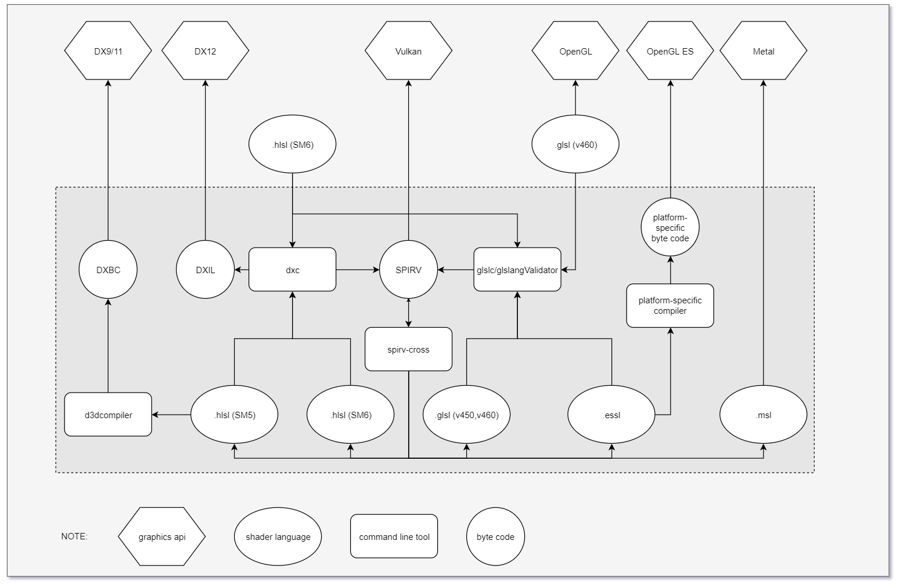

# Tools

## Bin

Various binary offline command line tools under different operating systems(Windows, Linux)

### CXX
- clang-tools, developed by LLVM, [[github](https://github.com/llvm/llvm-project)]
    - clang-format, a cpp code style formatter developed by LLVM, as an additional tool of clang compiler. [[Clang-Format Style Options(v14.0.0)](https://releases.llvm.org/14.0.0/tools/clang/docs/ClangFormatStyleOptions.html#:~:text=clang%2Dformat%20supports%20two%20ways,file%20in%20the%20project%20directory.)]

### Model
- gltf_validator, tool to validate glTF assets, developed by KhronosGroup. [[github](https://github.com/KhronosGroup/glTF-Validator)]
### SPIRV
- dxc, a hlsl compiler(hlsl -> **DXIL**/SPIRV), developed by Microsoft. [[github](https://github.com/microsoft/DirectXShaderCompiler)]
- glslang, a **glsl**/**essl**/hlsl compiler(glsl/essl/hlsl -> AST -> SPIRV), developed by KhronosGroup, [[github](https://github.com/KhronosGroup/glslang)]
    - glslangValidator, a command-line tool for accessing the functionality of glslang.
- SPIRV-Tools, APIs and command-tools for processing SPIR-V modules, developed by KhronosGroup, [[github](https://github.com/KhronosGroup/SPIRV-Tools)]
    - spirv-val, a syntax validator that checks the spec and produces only binary result: valid or invalid, developed by KhronosGroup, as a part of SPIRV-Tools. 
    - spirv-lint, a semantic detector that detects common semantic issues and bugs and generate warnings about likely bugs in shader, or acid existing automated tools like spirv-reduce that can sometimes produce semantically incorrect code. [[RFC](https://github.com/KhronosGroup/SPIRV-Tools/issues/3196)]
    - spirv-opt, a collection of code transforms, or "passes" that checks what spirv-lint checks and make actual optimization. [[SPIR-V Legalization and Size Reduction with spirv-opt](https://www.lunarg.com/shader-compiler-technologies/white-paper-spirv-opt/)].
    - spirv-link, a tool that combines multiple SPIR-V binary modules together.
- SPIRV-Cross, API to convert SPIR-V to readable, usable and efficient GLSL/MSL/HLSL and JSON reflection format, to simplify the creation of Vulkan pipeline layout, and to modify and tweak OpDecorations, developed by KhronosGroup, [[github](https://github.com/KhronosGroup/SPIRV-Cross)]
- glslc, wraps around core functionality in glslang and SPIRV-Tools for GLSL/HLSL to SPIR-V, developed by Google. [[github](https://github.com/google/shaderc)]

See [SPIR-V Toolchain](https://vulkan.lunarg.com/doc/view/1.3.231.1/windows/spirv_toolchain.html) for more details about above tools.

#### Shader Cross Compilation
Choose one of hlsl and glsl as handwritten, and then run it on all platforms.

